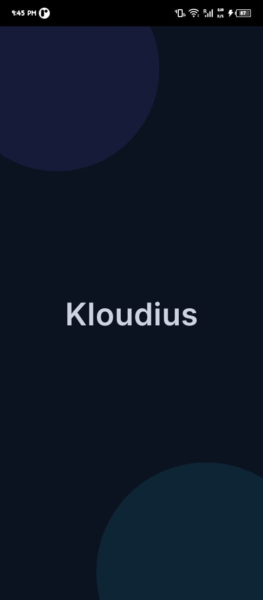
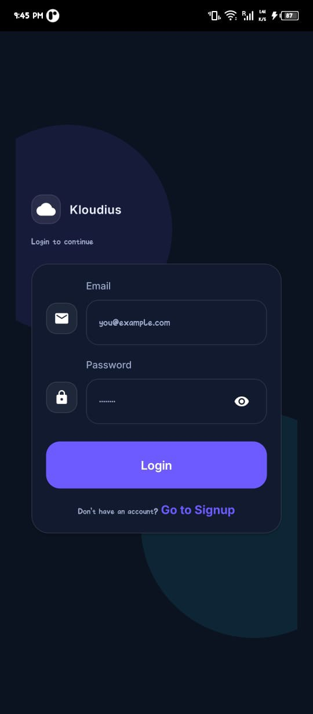
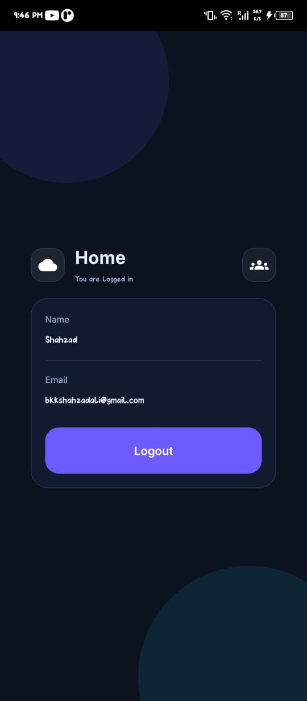
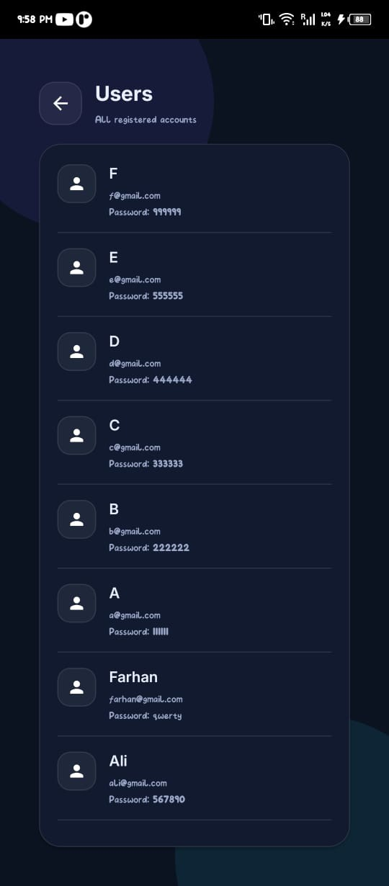
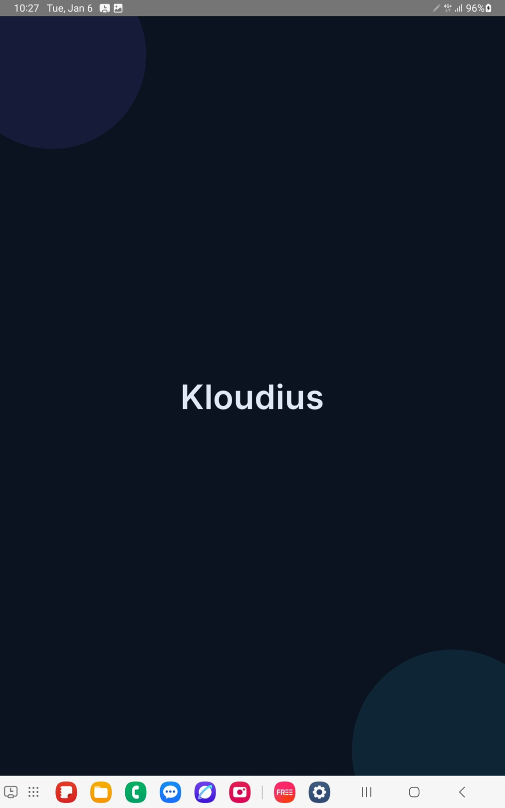
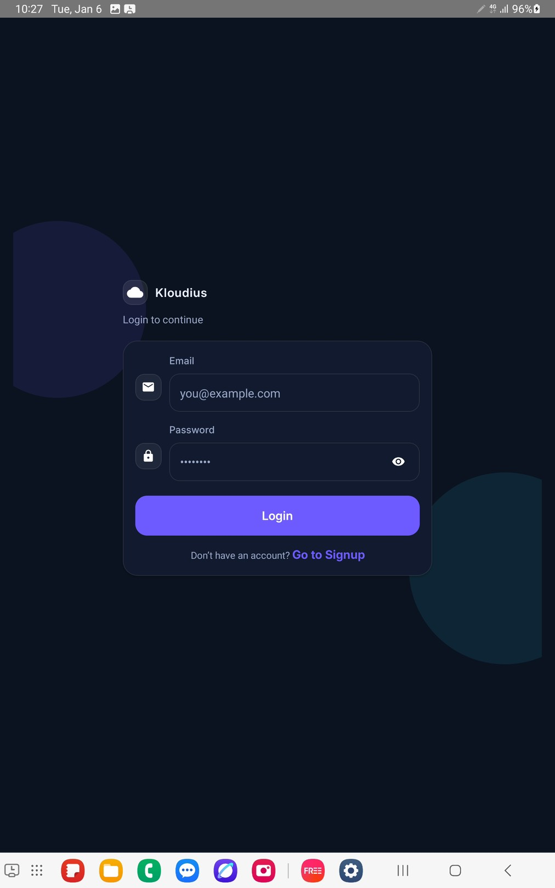
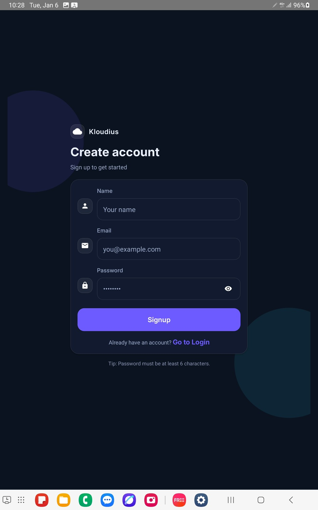
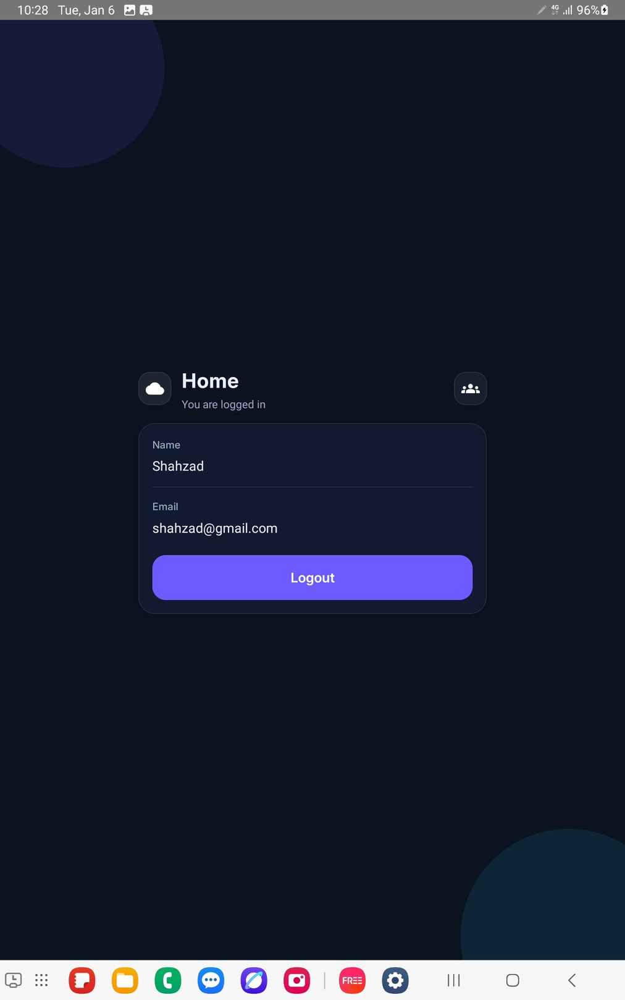
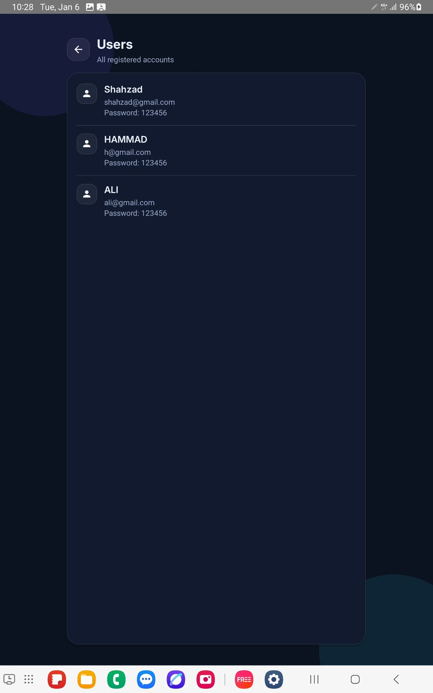

# User Authentication App

This project is a take-home assignment completed for **Kloudius Services**.  
It demonstrates a complete authentication flow built using **React Native** and **TypeScript**, focusing on state management, validation, persistence, and user experience.

---

## Features

### Authentication
- Login
- Signup
- Logout
- Global authentication state using React Context API

### User Management
- Multiple users supported
- Users stored locally using AsyncStorage
- Login possible with any registered user
- Persistent login after app restart

### Validation & UX
- Required field validation
- Email format validation
- Password length validation (minimum 6 characters)
- Clear error messages with clean UI
- Password visibility toggle (eye icon)
- App Launcher Icon

### Screens
- Login Screen
- Signup Screen
- Home Screen (User details + Logout)
- Users List Screen

### Navigation
- Implemented using React Navigation

---

## Tech Stack
- React Native
- TypeScript
- React Context API
- AsyncStorage
- React Navigation

---

##  Mobile Video Demo 
https://drive.google.com/file/d/1th6h_Iwg_zkipy-EVoMZN8KTOSUkkpWz/view?usp=drivesdk

##  Tablet Video Demo 
https://drive.google.com/file/d/1fAVDAWhNdcuWEpHxAeeOIzD7kSE9FstY/view?usp=drivesdk


##  Setup Instructions

```bash
git clone https://github.com/Shahzadali062/user-auth-app.git
cd user-auth-app
npm install

# Android
npm run android

---

## Screenshots

### Mobile

**Splash Screen**  


**Login Screen**  


**Signup Screen**  


**Home Screen**  


**Users List**  



---

### Tablet

**Splash Screen**  


**Login Screen**  


**Signup Screen**  


**Home Screen**  


**Users Screen**  

